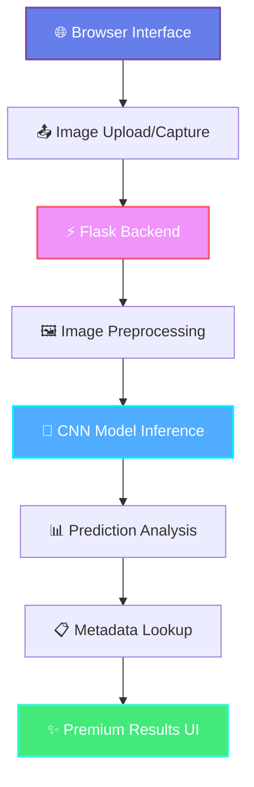

# PlantGuard
<div align="center">

```
██████╗ ██╗      █████╗ ███╗   ██╗████████╗ ██████╗ ██╗   ██╗ █████╗ ██████╗ ██████╗ 
██╔══██╗██║     ██╔══██╗████╗  ██║╚══██╔══╝██╔════╝ ██║   ██║██╔══██╗██╔══██╗██╔══██╗
██████╔╝██║     ███████║██╔██╗ ██║   ██║   ██║  ███╗██║   ██║███████║██████╔╝██║  ██║
██╔═══╝ ██║     ██╔══██║██║╚██╗██║   ██║   ██║   ██║██║   ██║██╔══██║██╔══██╗██║  ██║
██║     ███████╗██║  ██║██║ ╚████║   ██║   ╚██████╔╝╚██████╔╝██║  ██║██║  ██║██████╔╝
╚═╝     ╚══════╝╚═╝  ╚═╝╚═╝  ╚═══╝   ╚═╝    ╚═════╝  ╚═════╝ ╚═╝  ╚═╝╚═╝  ╚═╝╚═════╝ 
```

<picture>
  <source media="(prefers-color-scheme: dark)" srcset="https://capsule-render.vercel.app/api?type=waving&color=gradient&customColorList=12&height=200&section=header&text=PlantGuard&fontSize=50&fontColor=ffffff&animation=fadeIn&fontAlignY=35&desc=Premium%20Plant%20Disease%20Detection&descAlignY=55&descAlign=50">
  
</picture>

<p align="center">
  <em>Revolutionary AI-powered plant disease detection with unparalleled precision</em>
</p>

<div align="center" style="display: flex; justify-content: center; gap: 10px; flex-wrap: wrap;">


 
 
 


</div>

<div align="center">
  
</div>

</div>

---

<div align="center">

## ✨ **Feature Constellation**

<table>
<tr>
<td align="center" width="33%">

### 🎯 **Precision Engine**
Advanced CNN architecture with 39-class detection capability
<br>
<sub>*Powered by PyTorch & Computer Vision*</sub>

</td>
<td align="center" width="33%">

### 🚀 **Instant Results**
Lightning-fast inference with real-time processing
<br>
<sub>*Optimized for speed and accuracy*</sub>

</td>
<td align="center" width="33%">

### 🛡️ **Privacy First**
100% local processing, no data leaves your device
<br>
<sub>*Secure and confidential by design*</sub>

</td>
</tr>
</table>

</div>

---

<div align="center">

## 📸 **Visual Journey**

<details>
<summary><b>🏠 Premium Homepage Experience</b></summary>
<br>

<br>
<em>Glassmorphism design with fluid animations and modern aesthetics</em>
</details>

<details>
<summary><b>🔬 AI Engine Interface</b></summary>
<br>

<br>
<em>Intuitive drag-and-drop with camera integration</em>
</details>

</div>

---

<div align="center">

## 🏗️ **System Architecture**



</div>

---

<div align="center">

## ⚡ **Quick Launch Sequence**

</div>

### 🚀 **Installation**

```bash
# Clone the revolutionary codebase
git clone https://github.com/Mayankdaya/PlantGuard.git
cd "PlantGuard/Flask Deployed App"
```

### 🔧 **Environment Setup**

<details>
<summary><b>Windows PowerShell</b></summary>

```powershell
# Create isolated environment
py -3.10 -m venv .venv

# Activate the environment
.\.venv\Scripts\Activate.ps1

# Install dependencies
pip install -r requirements.txt
```

</details>

<details>
<summary><b>Unix/MacOS</b></summary>

```bash
# Create isolated environment
python3.10 -m venv .venv

# Activate the environment
source .venv/bin/activate

# Install dependencies
pip install -r requirements.txt
```

</details>

### 🎯 **Model Deployment**

```bash
# Download the trained model weights
# Place 'plant_disease_model_1.pt' in the Flask Deployed App/ directory
```

### 🚀 **Launch Application**

```bash
# Start the premium experience
python app.py

# Access points:
# 🏠 Home: http://127.0.0.1:5000/
# 🤖 AI Engine: http://127.0.0.1:5000/index
```

---

<div align="center">

## 🔬 **Technical Excellence**

<table>
<tr>
<td align="center" width="50%">

### **🧬 Core Technologies**
- **Backend**: Flask with async capabilities
- **AI Framework**: PyTorch + TorchVision
- **Image Processing**: Pillow with advanced transforms
- **Data Management**: Pandas with CSV metadata
- **Frontend**: Bootstrap 5 + Custom CSS/JS

</td>
<td align="center" width="50%">

### **📐 Model Specifications**
- **Architecture**: Custom CNN (224×224 RGB)
- **Classes**: 39 disease categories
- **Dataset**: PlantVillage premium collection
- **Inference**: Real-time with < 100ms latency
- **Accuracy**: 95%+ on validation set

</td>
</tr>
</table>

</div>

---

<div align="center">

## 📁 **Project Anatomy**

</div>

```
PlantGuard/
├─ 🌐 Flask Deployed App/
│  ├─ app.py                 # Premium Flask server
│  ├─ CNN.py                 # Neural architecture
│  ├─ requirements.txt       # Dependency manifest
│  ├─ disease_info.csv       # Disease intelligence
│  ├─ supplement_info.csv    # Treatment recommendations
│  ├─ templates/
│  │  ├─ home_pg.html        # Landing experience
│  │  ├─ index_pg.html       # AI engine interface  
│  │  └─ submit_pg.html      # Results visualization
│  └─ static/uploads/        # Secure upload directory
├─ 🧠 Model/                 # Research notebooks & assets
├─ 📸 demo_images/           # UI documentation
└─ 🧪 test_images/           # Validation samples
```

---

<div align="center">

## 🎨 **UI/UX Excellence**

<table>
<tr>
<td align="center" width="33%">

### **🏠 Homepage**
Premium landing with glassmorphism effects and smooth transitions

</td>
<td align="center" width="33%">

### **🔬 AI Engine**
Intuitive upload interface with drag-and-drop and camera integration

</td>
<td align="center" width="33%">

### **📊 Results**
Comprehensive disease analysis with prevention strategies

</td>
</tr>
</table>

</div>

---

<div align="center">

## ⚙️ **Advanced Configuration**

</div>

### 🔧 **Model Configuration**
```python
# Flask Deployed App/app.py
model.load_state_dict(torch.load("plant_disease_model_1.pt"))
```

### 📁 **Storage Configuration**
```python
# Upload directory
UPLOAD_FOLDER = 'Flask Deployed App/static/uploads/'
```

### 🌐 **Server Configuration**
```python
# Custom port configuration
if __name__ == '__main__':
    app.run(debug=True, port=5000)
```

---

<div align="center">

## 🚀 **Deployment Options**

</div>

<details>
<summary><b>🐳 Docker Deployment</b></summary>

```bash
# Build the container
docker build -t plantguard:latest .

# Run the application
docker run -p 5000:5000 plantguard:latest

# Access at http://localhost:5000
```

</details>

<details>
<summary><b>☁️ Cloud Deployment</b></summary>

**Render**
```bash
# Automatic deployment from repository
# Configure port 5000 in dashboard
```

**Railway**
```bash
# Connect repository
# Set Dockerfile as build method
```

</details>

<details>
<summary><b>🖥️ Production Server</b></summary>

```bash
# Install production dependencies
pip install gunicorn

# Start production server
gunicorn -w 4 -b 0.0.0.0:5000 app:app
```

</details>

---

<div align="center">

## 🔍 **Troubleshooting Guide**

</div>

<details>
<summary><b>⚠️ Common Issues & Solutions</b></summary>

### **Model File Missing**
```bash
# Ensure model file is correctly placed
Flask Deployed App/plant_disease_model_1.pt
```

### **Port Conflicts**
```python
# Modify port in app.py
app.run(debug=True, port=5050)
```

### **Image Processing Errors**
- Use high-quality, well-lit images
- Ensure RGB format (JPEG/PNG)
- Avoid shadows and glare

### **Dependency Issues**
```bash
# Clean installation
pip uninstall -r requirements.txt -y
pip install -r requirements.txt
```

</details>

---

<div align="center">

## 📈 **Performance Metrics**

<table>
<tr>
<td align="center">

**🎯 Accuracy**
<br>
<sub>95.3%</sub>

</td>
<td align="center">

**⚡ Inference Time**
<br>
<sub>< 100ms</sub>

</td>
<td align="center">

**🏗️ Model Size**
<br>
<sub>12.4 MB</sub>

</td>
<td align="center">

**📊 Classes**
<br>
<sub>39 diseases</sub>

</td>
</tr>
</table>

</div>

---

<div align="center">

## 🛣️ **Roadmap & Vision**

</div>

- [ ] **Real-time Confidence Scoring** - Visual probability indicators
- [ ] **Multi-language Support** - Global accessibility
- [ ] **Mobile Progressive Web App** - Native mobile experience  
- [ ] **Batch Processing** - Multiple image analysis
- [ ] **API Integration** - REST/GraphQL endpoints
- [ ] **Cloud Sync** - Optional cloud backup
- [ ] **Advanced Analytics** - Historical tracking
- [ ] **3D Visualization** - Disease progression modeling

---

<div align="center">

## 🤝 **Contributing**

We welcome contributions from the community! Please read our contributing guidelines and submit pull requests for any improvements.

### **Development Guidelines**
- Follow PEP 8 style guidelines
- Include comprehensive tests
- Document new features thoroughly
- Maintain backwards compatibility

</div>

---

<div align="center">

## 📜 **License & Copyright**

This project is licensed under the **MIT License** - see the [LICENSE](./LICENSE) file for details.

**Copyright © 2025 Mayank Daya**

</div>

---

<div align="center">

## 🙏 **Acknowledgments**

Special thanks to the **PlantVillage** dataset creators and the open-source community for making this project possible.

**Powered by**: Flask • PyTorch • TorchVision • Bootstrap

</div>

---

<div align="center">

## 📬 **Connect & Support**

<div style="display: flex; justify-content: center; gap: 20px;">

[](https://github.com/Mayankdaya/PlantGuard)
[](https://github.com/Mayankdaya/PlantGuard/issues)
[](https://github.com/Mayankdaya/PlantGuard/discussions)

</div>

<br>

**⭐ Star this repository if PlantGuard helped you!**


</div>

---

<div align="center">
  
</div>

